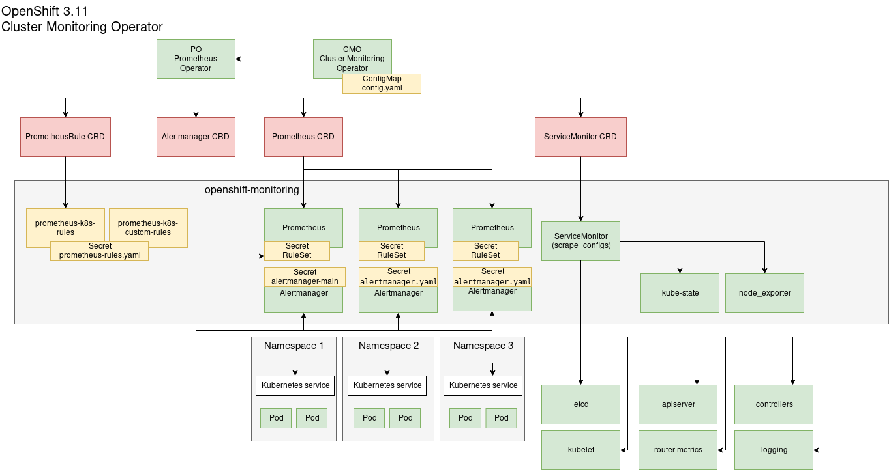

# Prometheus
Source: https://github.com/prometheus/prometheus

Visit [prometheus.io](https://prometheus.io) for the full documentation,
examples and guides.

Prometheus, a [Cloud Native Computing Foundation](https://cncf.io/) project, is a systems and service monitoring system. It collects metrics
from configured targets at given intervals, evaluates rule expressions,
displays the results, and can trigger alerts if some condition is observed
to be true.

Prometheus' main distinguishing features as compared to other monitoring systems are:

- a **multi-dimensional** data model (timeseries defined by metric name and set of key/value dimensions)
- a **flexible query language** to leverage this dimensionality
- no dependency on distributed storage; **single server nodes are autonomous**
- timeseries collection happens via a **pull model** over HTTP
- **pushing timeseries** is supported via an intermediary gateway
- targets are discovered via **service discovery** or **static configuration**
- multiple modes of **graphing and dashboarding support**
- support for hierarchical and horizontal **federation**

## Prometheus overview
The following diagram shows the general architectural overview of Prometheus:


## Monitoring use cases
Starting with OpenShift 3.11, Prometheus is installed by default to **monitor the OpenShift cluster** (depicted in the diagram below on the left side: *Kubernetes Prometheus deployment*). This installation is managed by the "Cluster Monitoring Operator" and not intended to be customized (we will do it anyway).  

To **monitor applications** or **define custom Prometheus configurations**, the Tech Preview feature [Operator Lifecycle Manager (OLM)](https://docs.openshift.com/container-platform/3.11/install_config/installing-operator-framework.html]) can be used to install the Prometheus Operator which in turn allows to define Prometheus instances (depicted in the diagram below on the right side: *Service Prometheus deployment*). These instances are fully customizable with the use of *Custom Ressource Definitions (CRD)*.  


(source: https://sysdig.com/blog/kubernetes-monitoring-prometheus-operator-part3/)

# Cluster Monitoring Operator


<https://github.com/openshift/cluster-monitoring-operator/tree/release-3.11>

## Installation

<https://docs.openshift.com/container-platform/3.11/install_config/prometheus_cluster_monitoring.html>

From OpenShift 3.11 onwards, the CMO is installed per default. To customize the installation you can set the following variables in inventory (small cluster)

```ini
openshift_cluster_monitoring_operator_install=true # default value
openshift_cluster_monitoring_operator_prometheus_storage_enabled=true
openshift_cluster_monitoring_operator_prometheus_storage_capacity=50Gi
openshift_cluster_monitoring_operator_prometheus_storage_class_name=[tbd]
openshift_cluster_monitoring_operator_alertmanager_storage_enabled=true
openshift_cluster_monitoring_operator_alertmanager_storage_capacity=2Gi
openshift_cluster_monitoring_operator_alertmanager_storage_class_name=[tbd]
openshift_cluster_monitoring_operator_alertmanager_config=[tbd]
```

Run the installer

```
[ec2-user@master0 ~]$ ansible-playbook /usr/share/ansible/openshift-ansible/playbooks/openshift-monitoring/config.yml
```

### Access Prometheus

You can login with the cluster administrator `sheriff` on:
https://prometheus-k8s-openshift-monitoring.app[X].lab.openshift.ch/

- Additional targets: `Status` -> `Targets`
- Scrape configuration: `Status` ->  `Configuration`
- Defined rules: `Status` -> `Rules`
- Service Discovery: `Status` -> `Service Discovery`


### Configure Prometheus
Let Prometheus scrape service labels in different namespaces

```
[ec2-user@master0 ~]$ oc adm policy add-cluster-role-to-user cluster-reader -z prometheus-k8s -n openshift-monitoring
```

To modify the Prometheus configuration - e.g. retention time, change the ConfigMap `cluster-monitoring-config` as described here:
<https://github.com/openshift/cluster-monitoring-operator/blob/release-3.11/Documentation/user-guides/configuring-cluster-monitoring.md>

```
[ec2-user@master0 ~]$ oc edit cm cluster-monitoring-config -n openshift-monitoring
```

Unfortunately, changing the default scrape config is not supported with the Cluster Monitoring Operator.

#### etcd monitoring

To add etcd monitoring, follow this guide:
<https://docs.openshift.com/container-platform/3.11/install_config/prometheus_cluster_monitoring.html#configuring-etcd-monitoring>

## Additional services: CRD type ServiceMonitor (unsupported by Red Hat)

Creating additional ServiceMonitor objects is not supported by Red Hat. See [Supported Configuration](https://docs.openshift.com/container-platform/3.11/install_config/prometheus_cluster_monitoring.html#supported-configuration) for details.

We will do it anyway :sunglasses:.

In order for the custom services to be added to the managed Prometheus instance, the label `k8s-app` needs to be present in the "ServiceMonitor" *Custom Ressource (CR)*

See example for *Service Monitor* `router-metrics`:

```yaml
apiVersion: monitoring.coreos.com/v1
kind: ServiceMonitor
metadata:
  generation: 1
  labels:
    k8s-app: router-metrics
  name: router-metrics
  namespace: ""
spec:
  endpoints:
  - bearerTokenFile: /var/run/secrets/kubernetes.io/serviceaccount/token
    honorLabels: true
    interval: 30s
    port: 1936-tcp
    scheme: https
    tlsConfig:
      caFile: /var/run/secrets/kubernetes.io/serviceaccount/service-ca.crt
      insecureSkipVerify: true
  namespaceSelector:
    matchNames:
    - default
  selector:
    matchLabels:
      router: router
```

### Router Monitoring

Create the custom cluster role `router-metrics` and add it to the Prometheus service account `prometheus-k8s`, for Prometheus to be able to read the router metrics.
First you need to check, what labels your routers are using.

```
[ec2-user@master0 ~]$ oc get endpoints -n default --show-labels
NAME               ENDPOINTS                                                            AGE       LABELS
router             172.31.43.147:1936,172.31.47.59:1936,172.31.47.64:1936 + 6 more...   1h        router=router
```

Add the `prometheus-k8s` service account to the `router-metrics` cluster role
```
[ec2-user@master0 ~]$ oc adm policy add-cluster-role-to-user router-metrics system:serviceaccount:openshift-monitoring:prometheus-k8s
```

Set the router label as parameter and create the service monitor
```
[ec2-user@master0 ~]$ oc project openshift-monitoring
[ec2-user@master0 ~]$ oc process -f resource/templates/template-router.yaml -p ROUTER_LABEL="router" | oc apply -f -
```

### Logging Monitoring
Just works on clustered ElasticSearch, the OPStechlab runs because of lack of ressources on a single node ES. 
The Service `logging-es-prometheus` needs to be labeled and the following RoleBinding applied, for Prometheus to be able to get the metrics.

```
[ec2-user@master0 ~]$ oc label svc logging-es-prometheus -n openshift-logging scrape=prometheus
[ec2-user@master0 ~]$ oc create -f resource/templates/template-rolebinding.yaml -n openshift-logging
[ec2-user@master0 ~]$ oc process -f resource/templates/template-logging.yaml  | oc apply -f -
```

## Additional rules: CRD type PrometheusRule

Take a look at the additional ruleset, that we suggest to use monitoring OpenShift.
```
[ec2-user@master0 ~]$ less resource/templates/template-k8s-custom-rules.yaml
```

Add the custom rules from the template folder to Prometheus:

```
[ec2-user@master0 ~]$ oc process -f resource/templates/template-k8s-custom-rules.yaml -p SEVERITY_LABEL="critical" | oc apply -f -
```

## AlertManager

Configuring Alertmanager with the Red Hat Ansible playbooks.
<https://docs.openshift.com/container-platform/3.11/install_config/prometheus_cluster_monitoring.html#configuring-alertmanager>

By hand

```
[ec2-user@master0 ~]$ oc delete secret alertmanager-main
[ec2-user@master0 ~]$ oc create secret generic alertmanager-main --from-file=resource/templates/alertmanager.yaml
```

Follow these guides:
<https://github.com/openshift/cluster-monitoring-operator/blob/release-3.11/Documentation/user-guides/configuring-prometheus-alertmanager.md>

Check if the new configuration is in place: https://alertmanager-main-openshift-monitoring.app[X].lab.openshift.ch/#/status

## Additional configuration

### Add view role for developers

Let non OpenShift admins access Prometheus:
```
[ec2-user@master0 ~]$ oc adm policy add-cluster-role-to-user cluster-monitoring-view [user]
```

### Add metrics reader service account to access Prometheus metrics

You can create a service account to access Prometheus through the API 
```
[ec2-user@master0 ~]$ oc create sa prometheus-metrics-reader -n openshift-monitoring
[ec2-user@master0 ~]$ oc adm policy add-cluster-role-to-user cluster-monitoring-view -z prometheus-metrics-reader -n openshift-monitoring
```

Access the API with a simple `curl`
```
[ec2-user@master0 ~]$ export TOKEN=`oc sa get-token prometheus-metrics-reader -n openshift-monitoring`
[ec2-user@master0 ~]$ curl https://prometheus-k8s-openshift-monitoring.app[X].lab.openshift.ch/api/v1/query?query=ALERTS -H "Authorization: Bearer $TOKEN"
```

### Allow Prometheus to scrape your metrics endpoints (if using ovs-networkpolicy plugin)

Create an additional network-policy.

```
[ec2-user@master0 ~]$ oc create -f resource/templates/networkpolicy.yaml -n [namespace]
```
