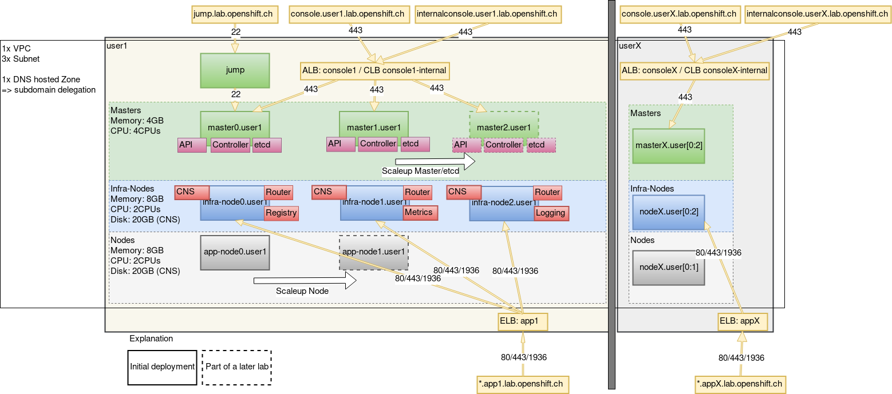

## Lab 1.1: Architectural Overview

This is the environment we will build and work on. It is deployed on Amazon AWS.

Our lab installation consists of the following components:
1. Three Load Balancers
  1. Application Load Balancer app[X]: Used for load balancing requests to the routers (*.app[X].lab.openshift.ch)
  1. Application Load Balancer console[X]: Used for load balancing reqeusts to the master APIs (console.user[X].lab.openshift.ch)
  1. Classic Load Balancer console[X]-internal: Used for internal load balancing reqeusts to the master APIs (internalconsole.user[X].lab.openshift.ch)
1. Two OpenShift masters, one will be added later
1. Two etcd, one will be added later
1. Three infra nodes, where the following components are running:
  1. Container Native Storage (Gluster)
  1. Routers
  1. Metrics
  1. Logging
  1. Monitoring (Prometheus)
1. One app node, one will be added later
1. We are going to use the jump host as a bastion host (jump.lab.openshift.ch)

---

**End of Lab 1.1**

<a href="12_access_environment.md">1.2 Access the Lab Environment →</a>

[← back to the Chapter Overview](10_warmup.md)
