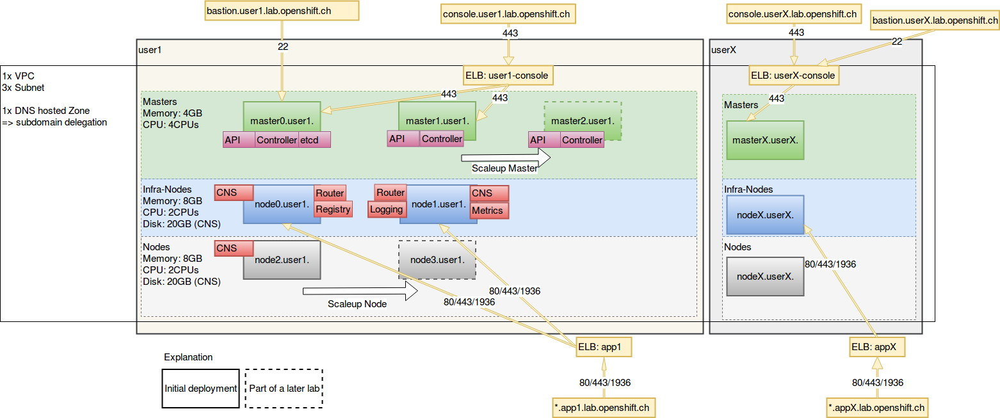

Lab 3.1: Warmup
============

Lab 3.1.1: Get a short architectural overview of the environment
-------------
This is the environment, we will build and work on. It's deployed on Amazon AWS.

## Architecture

Out lab Platform consist of the following components:
1. Two AWS | Elastic Load Balancer
    1. ELB appX: Used for load balancing to the routers, where the apps are running. (*.appX.lab.openshift.ch)
    1. ELB userX-console: Used for Loadbalancing to the Masters for external access. (console.user1.lab.openshift.ch)
1. Two Openshift Masters, which we will scaleup to three masters in a lab.
    1. On the first Master etcd is running.
    1. On all Masters are the master-api and master-controller daemons running.
1. Two Infra-Nodes, where the following components are running.
    1. Container Native Storage
    1. Routers
    1. Metrics
    1. Logging
1. One worker node, which we will scaleup to two nodes in a lab
1. We will use the first master as a Bastion host because of simplicity of the labs. (bastion.userX.lab.openshift.ch)
    1. (For production use it's recommended to use a separate instance for this.)

---

**End of Lab 3.1.1**

<a href="312_access_environment.md">Learn how to access the lab environment →</a>

[← back to overview](../README.md)
